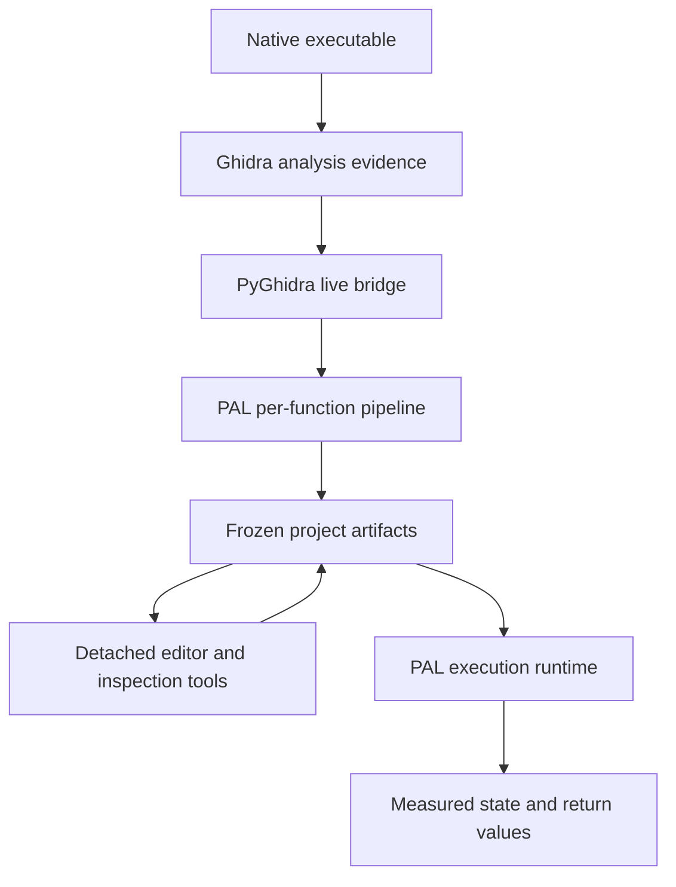
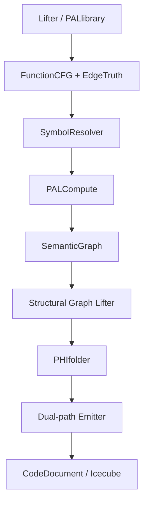
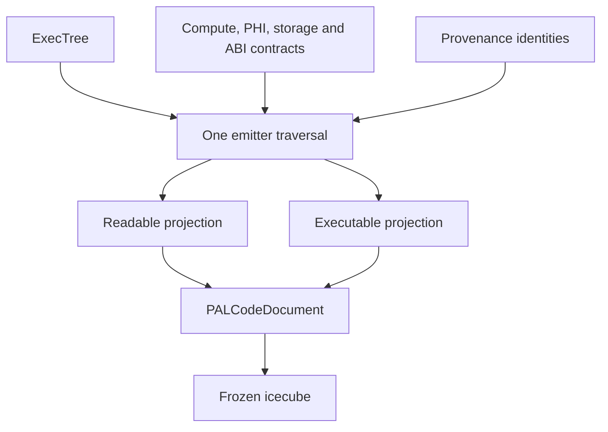
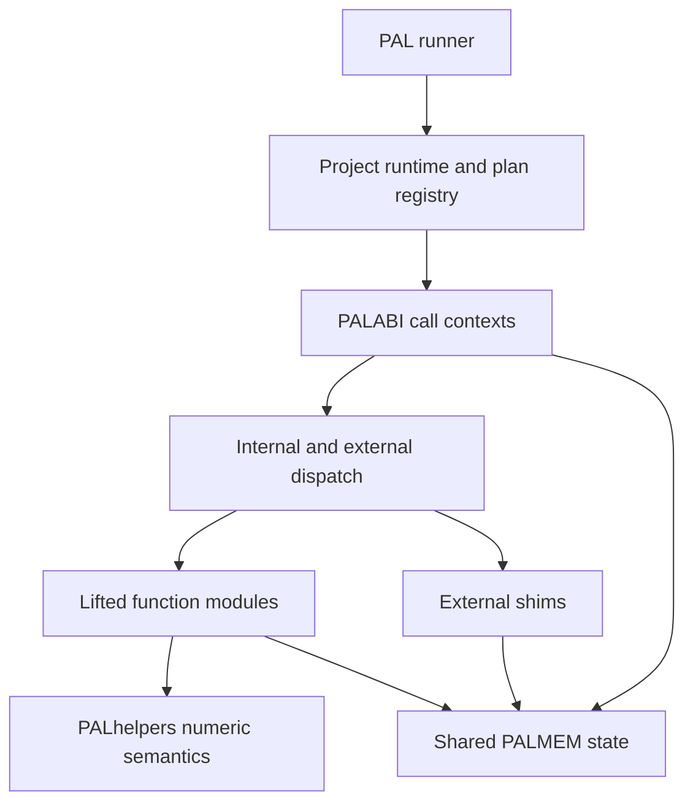

# 🛠️ v0.23 UPDATE — PRE-ALPHA DEPLOYMENT FIX

This update fixes several major initial-release errors which directly impacted PAL functionality, generated-code fidelity, project portability and actual EXEC execution.

The important thing: the full 9-specimen O0/O3 + `drop_axe` matrix now imports, publishes and executes successfully.

Very terse damage report / repairs:

- portable PAL project paths; removed private absolute-path dependence
- hardened PyGhidra import and fresh-project handling
- fixed stale/recompiled ONCS function-name registry migration
- restored static string extraction and READ string materialization
- fixed missing ABI argument-to-local initialization
- fixed PHI-entry local-state seeding
- stopped mutable locals collapsing back into ABI parameters
- restored exact machine-carrier aliases such as `in_FS_OFFSET -> abi_tls_base`
- preserved immutable TLS/stack context through later SSA state
- added unbound EXEC identity rejection before runtime
- stabilized generated EXEC publication and shared runtime layout
- added PAL stack-version stamps to generated READ/EXEC files
- added portable full-matrix regeneration and publication scripts
- verified all nine current matrix specimens through import and execution

PAL is still pre-alpha. It will still find walls, termites, strange compiler fossils and functions which invent a new category of trouble. But this update removes the major first-release execution blockers and gives the project a much cleaner deployment baseline.

I wanna personally thank you for your interest in this project.

---


---

### pre-Alpha v0.23 (work in progress)

# PAL Architecture: PyGhidra Evidence to Executable Python State Machine

**Document role:** architecture starter and custody map  
**Status:** living experimental alpha design  
**AI analysis stack:** code: GPT SOL high & max / adversarial: GEMINI Flash extended / Sonnet 5 extra 

---

### PAL has demonstrated executable-to-Python state-machine recovery with behavioral convergence across a limited controlled corpus.

---

## The 80386 80s Terminal View

#### Four-Pane Simultaneous, Context-Linked ASM, C, and Python Analysis View


---

## Codium Step Debug of PAL .py Projection


---

#### PAL is an execution-oriented binary reconstruction and forensic analysis layer built over Ghidra, producing evidence-linked readable and executable Python projections that can be compared directly against assembly and decompiled C.

---

# System Topology



Ghidra provides several views of the same program:

- assembly and raw instruction flow;
- raw p-code;
- HighFunction p-code and SSA identities;
- recovered types, symbols, storage, signatures, and decompiled C.

Ghidra C is valuable comparative evidence, but it is not PAL's sole authority.
PAL reconciles it with p-code, CFG topology, physical storage, and ABI evidence.

## PAL Decompiler Stack



### 1. Lifter / `PALlibrary`

The lifter is PAL's high-resolution import boundary.

**Consumes:** Ghidra Program, Function, HighFunction, raw instructions, raw and
high p-code, symbols, storage, datatypes, prototypes, and calling-convention
evidence.

**Publishes:** PAL functions, blocks, operations, variables, SSA identities,
physical storage images, function signatures, call targets, return carriers,
`INDIRECT` effect-owner custody, and architecture evidence.

**Owns:** faithful capture of Ghidra facts and their provenance.

It does not decide how Python arithmetic should behave or how a CFG should be
printed. It records the evidence required for later layers to decide those
questions explicitly.

### 2. `FunctionCFG` and `EdgeTruth`

This layer reconstructs control topology independently from presentation.

**Publishes:** normalized nodes and edges, entry and exits, dominators,
post-dominators, immediate dominators, loop headers, latches, backedges, loop
exits, and edge-oriented predicate truth.

`EdgeTruth` binds a condition to an exact `(source, destination)` edge. It
combines HighFunction branch targets, raw target/fallthrough flow, condition
p-code, and instruction evidence. If custody cannot be proven, truth remains
unresolved rather than being guessed from a mnemonic.

### 3. `PALSymbolResolver`

The resolver separates identities that source-like text tends to blur:

```text
physical storage identity
logical value identity
numeric interpretation at a use site
ABI carrier identity
human-facing alias
```

**Publishes:** stable variable names, width/domain/signedness contracts,
conversion classifications, storage-family aliases, and ABI namespaces:

```text
logical parameter | physical ABI carrier | implicit machine input
```

The resolver does not lift SSA into PAL objects—the lifter already did that.
It explains what those objects mean and how their identities relate.

### 4. `PALCompute`

PALCompute converts p-code operations into deterministic execution contracts.

Each operation contract can specify:

- input SIDs and exact widths;
- signed, unsigned, Boolean, pointer, or raw-bit interpretation;
- result width and normalization;
- runtime helper authority;
- hazards caused by Python's unbounded integers;
- metadata-only, helper-required, or deferred status;
- storage-custody and `INDIRECT` relationships.

PALCompute also publishes ABI-D plans:

```text
function_entry_abi_plan
call_site_abi_plan
return-carrier contract
```

Downstream layers consume these plans. They may not infer carrier placement from
variable names or expression appearance.

### 5. `PALSemanticGraphBuilder`

The semantic graph maps relationships between values and operations.

**Publishes:** formula nodes, variable dependencies, PHI relationships,
condition dependencies, latch/update facts, storage observations, and metadata
sidecars used by structural and state layers.

It answers “which definitions and operations contribute to this value?” It does
not own branch orientation or final control structure.

### 6. `PALSGLdecomp` — Structural Graph Lifter

SGL means **Structural Graph Lifter**.

Its essential transformation is:

```text
FunctionCFG + EdgeTruth + structural metadata -> ExecTree
```

The ExecTree contains structural nodes such as:

```text
sequence | block | if/else | loop | break | continue | join
```

SGL owns branch-arm orientation, loop condition roles, shared joins, direct-join
ownership, short-circuit regions, latch separation, and loop headers that also
contain internal payload diamonds. It deliberately does not prettify source or
reinterpret numeric expressions.

### 7. `PALPHIfolder`

PHIfolder converts SSA convergence into executable state transitions.

**Publishes:** predecessor-owned PHI drop-ins, stable state aliases, transition
owners, narrow must-print obligations, storage-family custody, and ABI entry or
convergence ownership.

For every merge, the important question is not merely “what is the PHI output?”
but:

```text
which predecessor writes which runtime state before entering the join?
```

PHIfolder preserves PALCompute authority while remapping execution destinations.
It must not reinterpret arithmetic or branch polarity.

### 8. `PALemitter`

The emitter performs one ExecTree traversal with two rendering policies:

- **readable projection:** compact C-like pseudo-Python for human cognition;
- **executable projection:** fixed-width helper and runtime calls suitable for
  controlled execution.

The emitter is a contract consumer. It must not rediscover widths, signedness,
PHI ownership, edge truth, memory aliases, or ABI carriers from textual clues.

Broad SSA-noise suppression remains in force. Execution-critical exceptions use
narrow, occurrence-owned **must-print** overrides rather than disabling the
suppressor globally.

### 9. `PALCodeDocument` and PAL Icecube

The emitted ASCII stream is not the complete program representation.
`PALCodeDocument` links text to its ground truth:

- projection and line number;
- semantic statement ID;
- CFG block and ExecTree occurrence;
- operation keys;
- definition and use SIDs;
- token spans;
- metadata references;
- original/modified state;
- machine, cognitive, and operator aliases.

An **icecube** freezes this model into JSON without live JVM or PyGhidra objects.
It is the detached boundary between analysis and ordinary CPython tools.

### 10. Batch, Manifest, and Terminal UI

The batch layer applies the single-function stack independently to every Ghidra
function. It records success or failure per function so one pathological body
does not erase the project.

The manifest and jump table provide function name/address discovery. The
terminal UI opens frozen icecubes, synchronizes readable and executable views,
resolves cursor positions to metadata, applies aliases or edits, and exports
revised ASCII projections.

## One Emitter, Two Projections



The projections are paired by semantic statement identity, not by fragile line
number coincidence. A readable line can hide fixed-width machinery while its
executable partner retains exact helper calls and both point to the same source
operations.

## Project Artifact Layout

```text
PAL/
└── projects/
    └── <program_name>/
        ├── PAL_dispatch.py
        ├── PAL_function_manifest.json
        ├── PAL_jump_table.json
        ├── functions/
        │   ├── <function>.pal.json
        │   ├── <function>.read.pal.py
        │   ├── <function>.exec.pal.py
        │   └── ...
        └── execute/
            ├── config.exec.json
            ├── PAL_runner.py
            ├── PAL_project_runtime.py
            ├── runtime/
            │   ├── PALhelpers.py
            │   ├── PALABI.py
            │   └── PALMEM.py
            ├── shims/
            │   ├── libc.py
            │   ├── system.py
            │   └── ...
            └── functions/
                ├── <function>.exec.pal.py
                └── ...
```

Function filenames may be address-prefixed for uniqueness. The conceptual
separation is more important than the spelling:

- `functions/` under the project contains analysis artifacts and icecubes;
- `execute/functions/` contains the selected executable projection set;
- `runtime/` contains PAL machinery;
- `shims/` contains modeled external-library or operating-system boundaries.

## Runtime Architecture



### `PALhelpers.py`

Architecture-neutral fixed-width numeric truth: masking, signed and unsigned
comparisons, shifts, extension, truncation, C division and remainder, bitwise
operations, and generic byte-addressable loads/stores.

### `PALABI.py`

Architecture calling-convention truth. The SysV AMD64 backend provides GPR and
XMM carriers, `%al`, register-save and overflow areas, `va_list`, stack/frame
bases, TLS, plan-driven calls, return carriers, and shared-MEM observability.

Future backends can implement the same runtime contract:

```text
win64 | aarch64 | x86_cdecl
```

### `PALMEM.py`

The planned unified memory layer will model mapped program data, stack, TLS,
globals, pointers, allocation, permissions, and external memory effects. It
must remain one shared state observed by lifted functions, PALABI, and shims.

### Project Runtime and Shims

The project runtime loads frozen entry/call plans, establishes thread and memory
contexts, resolves internal functions through the dispatch table, and routes
external calls to explicit shims. A shim is a modeled boundary—not permission
to call an arbitrary host function with guessed semantics.

## Failure Localization

| Symptom | Primary owner to inspect |
|---|---|
| Wrong successor, branch arm, loop, break, or join | FunctionCFG / EdgeTruth / SGL |
| Correct structure but wrong state at a merge | PHIfolder |
| Signedness, overflow, shift, division, or width divergence | SymbolResolver / PALCompute / PALhelpers |
| Pointer alias or implicit memory mutation is lost | Lifter indirect custody / Compute / PHIfolder / PALMEM |
| Wrong parameter, register, `%al`, stack argument, or return carrier | ABI metadata / PALABI |
| Correct metadata but missing or duplicated Python statement | Emitter |
| Cursor cannot reach source truth or projections desynchronize | CodeDocument / Icecube / UI |
| Function cannot call another function or an import | Manifest / project runtime / dispatch / shim |

## Proven State and Open Frontier

### Demonstrated

- A controlled O0/O3 regression family exercises branches, loops, PHIs,
  shifts, signed arithmetic, switch lowering, and optimizer transformations.
- A real Ubuntu `seq` function expanded structural coverage into shared returns,
  memory access, character normalization, and loop-header payload diamonds.
- PALexec produced the same measured result as native compiled C:
  `309755405 (0x12767e0d)`.
- `INDIRECT` effect-owner and storage-family custody now travel from lifting
  through executable emission without raw `indirect(...)` syntax leakage.
- Detached function manifests, icecubes, paired projections, provenance lookup,
  edits, and terminal browsing are operational.
- ABI-A through ABI-F publish physical/logical identities, entry/call plans, and
  convergence custody.
- ABI-G provides a tested SysV AMD64 runtime frame: zero-vararg `%al`, GP and
  XMM carriers, overflow storage, register-save area, and in-memory `va_list`.

### Not Yet Claimed

- full native-equivalent execution of the complete `seq` project;
- complete mapped ELF data, heap, globals, TLS, and permission behavior;
- comprehensive libc and operating-system shims;
- every aggregate/vector ABI classification;
- mature indirect-call and dynamic-linker behavior;
- a complete inter-function relation graph.


## Compact Glossary

| Term | Meaning in PAL |
|---|---|
| SSA | Static Single Assignment identities imported from HighFunction |
| CFG | Function control-flow graph |
| HF p-code | Ghidra HighFunction p-code after decompiler normalization |
| EdgeTruth | Authoritative predicate orientation for one CFG edge |
| SemanticGraph | Formula and dependency graph over PAL values and operations |
| SGL | **Structural Graph Lifter**, CFG topology to ExecTree |
| ExecTree | Structured sequence/branch/loop representation consumed by the emitter |
| PHI drop-in | Assignment executed on one predecessor transition before a join |
| Compute contract | Width, interpretation, normalization, and helper authority for an operation |
| Icecube | JVM-free frozen function document containing code and provenance |
| Custody | Explicit ownership and transport of a semantic decision across layers |
| Projection | Readable or executable textual view of the same semantic statements |

---


