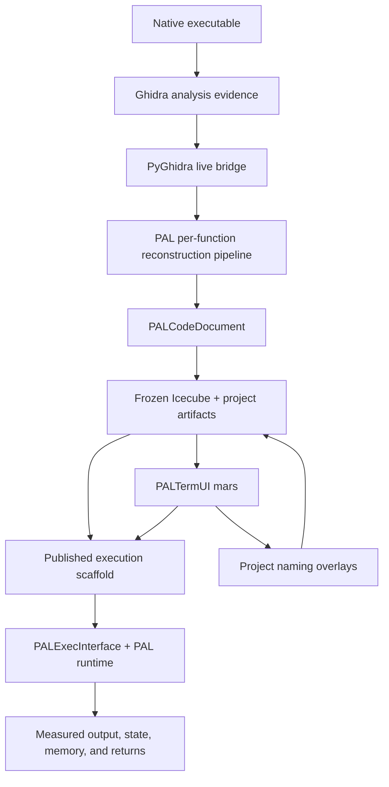
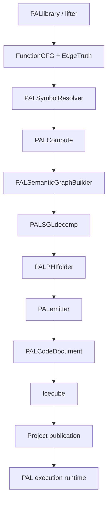
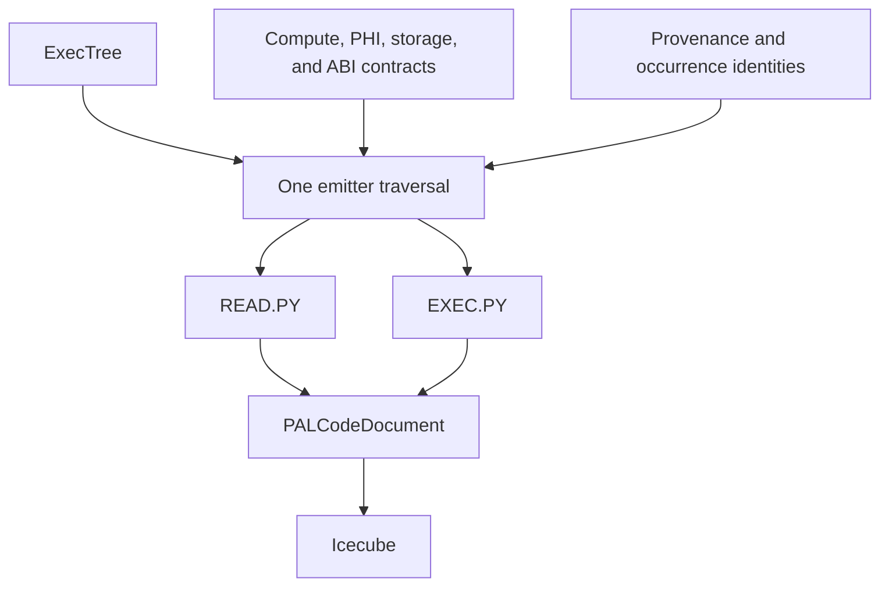
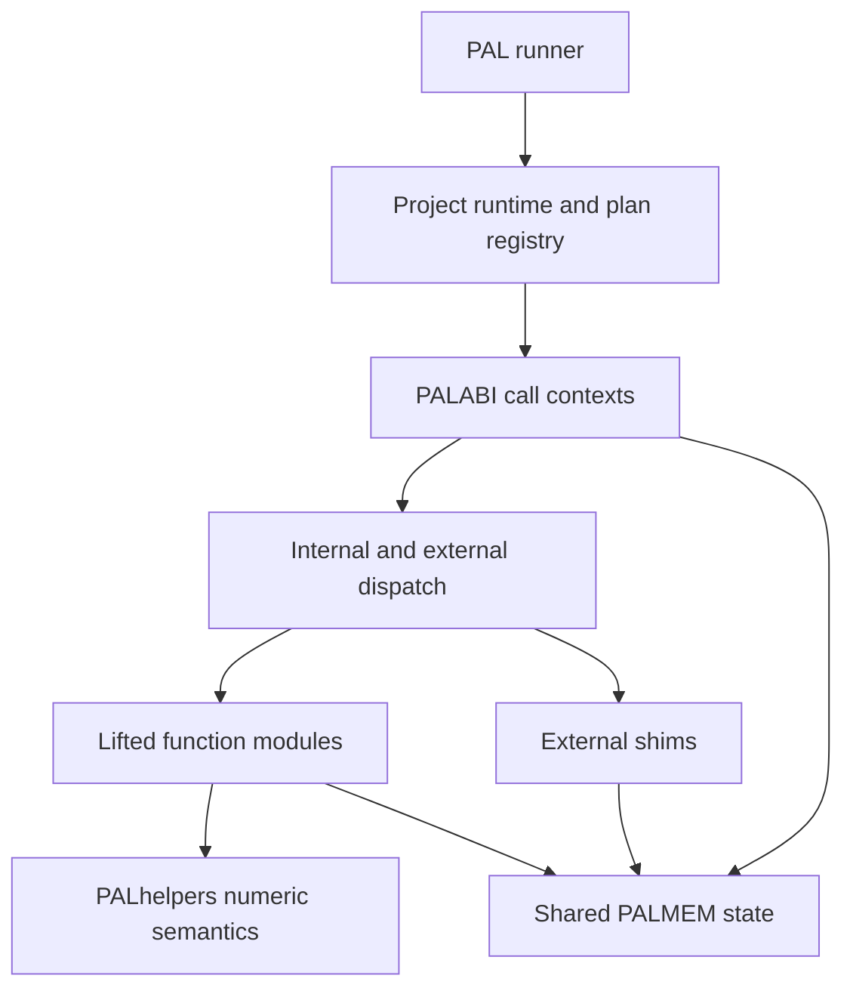
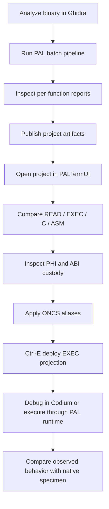

# ⚙️ Update

## 📣 PAL Alpha v0.24b — `PALTermUI (mars)` Finalizer + `seq` Decompilation Project

PAL Alpha v0.24b introduces a substantial update to `PALTermUI (mars)`, focused primarily on the `STATIC DEBUG` workspace.

The PHI pane has been reworked into a more practical materialization cross-section. It now presents variables through their actual materialization blocks and assignments, with direct linkage to the corresponding ASM and Python views.

The synchronized panes make it possible to inspect the same function state through three connected layers:

```text
PHI materialization
ASM / machine truth
READ.py / recovered Python
```

The PHI pane now supports:

* focal-block materialization views;
* unfolded Full mode blades for all materialized variables;
* ordering by variable activity, block count, and write count;
* direct display of the Python assignment associated with each materialization;
* preservation of repeated execution occurrences;
* classification of both human-facing variables and semantically used temporary variables;
* removal of distracting virtual PHI ancestry and passive merge records.

ASM and PHI now maintain independent navigation histories, including their cursor positions. Pane focus changes no longer clear those histories.

A number of smaller interface issues have also been addressed:

* corrected key mappings;
* pane-local search and highlight controls;
* persistent ASM and PHI history;
* removal of the old `:` command pathway;
* reduced legacy element-sensitive metadata work in OVERVIEW;
* improved ASM scrolling continuity by retaining context above the focused block;
* revised four-pane OVERVIEW layout;
* visible loading notices for larger functions;
* fixes for situational pane lockups and stale focus behavior.

The four-pane OVERVIEW layout is now:

```text
ASM / MACHINE TRUTH     EXEC.PY
GHIDRA C                READ.PY
```

## `seq` Decompilation Project

This release also includes a PAL project containing most of the GNU `seq` binary in decompiled form.

The project includes the large function corresponding approximately to `seq`’s `main()`, recovered as more than 650 lines of readable Python. This function has served as PALTermUI’s primary real-world stress specimen during development of the new PHI, ASM, and Python linkage interface.

It contains substantially more complex behavior than PAL’s synthetic specimens, including:

* extensive branching and early exits;
* x87 floating-point operations;
* reconstructed multiword values;
* string and locale handling;
* stack and TLS checks;
* many temporary values and repeated materializations.

The PAL stack that produced this partial `seq` decompilation is not included in this release. It will be published after a longer period of regression testing and validation.

Thank you for your attention,
Remy

---

---

# 🐉 PAL — PyGhidra Python Abstract Layer

## `mars` Alpha Release - v0.24b (mars)

**PAL is an execution-oriented binary reconstruction and forensic analysis layer built on Ghidra and PyGhidra.** It turns decompiler evidence into two linked Python projections—one optimized for human reading and one designed for controlled execution—while preserving a traceable connection back to assembly, p-code, control-flow structure, SSA state, physical storage, ABI carriers, and emitted runtime behavior.

PAL is not a source-code recovery claim. It is an evidence-custody system for reconstructing executable behavior in a form that can be inspected, challenged, renamed, exported, and run.

> **Current alpha milestone:** the `mars` stack has completed a controlled 12-specimen matrix through binary analysis, decompilation, publication, and PAL execution with zero pipeline failures. This is a meaningful alpha milestone, not a claim of universal binary coverage.

---

## Why PAL exists

Traditional decompilation produces a useful approximation of source code. That approximation is often enough for reading, but it can blur several things that matter when the goal is execution or forensic proof:

- the exact machine edge that made a branch true or false;
- the distinction between a logical value and the register or stack slot carrying it;
- the predecessor on which a PHI state transition must occur;
- the width, signedness, and normalization rules hidden by a source-like expression;
- the difference between a readable simplification and the machinery required to reproduce native behavior;
- the provenance connecting one line of reconstructed code to the instructions and p-code that justified it.

PAL treats those details as first-class contracts rather than emitter guesses.

The result is a pipeline that can answer not only:

> “What does this function appear to do?”

but also:

> “Which machine evidence authorized this state transition, which layer owns the decision, which Python statement consumed it, and what runtime semantics are required for the result to remain executable?”

That is the organizing idea behind the entire system.

---

## Release status: what “alpha” means here

`mars` is the first PAL release line that is coherent enough to be used as an integrated analysis and execution system rather than a collection of experiments.

The alpha currently demonstrates:

- end-to-end per-function reconstruction from Ghidra evidence;
- structured branch, loop, switch, join, and PHI handling across a controlled corpus;
- paired readable and executable Python projections;
- detached function artifacts that can be opened without a live JVM;
- project manifests, dispatch metadata, execution scaffolds, and runtime integration;
- a synchronized VT100/curses terminal interface for ASM, C, PHI, READ.PY, and EXEC.PY;
- persistent project-level naming overlays;
- direct export of the active executable naming projection into the live project runtime;
- successful execution of the current 12-specimen validation matrix.

The alpha does **not** claim:

- correct reconstruction of arbitrary binaries;
- full native-equivalent behavior for every libc, operating-system, dynamic-linker, indirect-call, vector, aggregate, or architecture-specific edge case;
- automatic safety of generated Python;
- replacement of Ghidra, a debugger, symbolic execution, or manual reverse engineering;
- recovery of original source formatting, comments, variable names, types, or programmer intent;
- that readable Python and executable Python should be textually identical.

A PAL failure is expected to remain local and explainable. The system prefers an explicit unresolved contract over a plausible-looking guess.

---

# A first look at `mars`

## STATIC DEBUG — linked PHI, ASM, and Python


STATIC DEBUG is the focused evidence workbench. A selected Python statement can refresh its owning machine block and PHI transition context; selecting an ASM block can refresh the corresponding Python and custody views.

The visual language is deliberately consistent:

- **dark red** — the active linkage root or selected execution block;
- **green** — forks, pass-through paths, and related source paths;
- **yellow** — joins, completion points, and terminal convergence;
- **red jump mnemonics** — machine branch commands remain visible even when their block is highlighted;
- **cyan instruction addresses** — machine location remains readable on active surfaces.

The entire ASM block surface receives the active background. PAL does not highlight only a token while leaving the rest of the block visually ambiguous.

## OVERVIEW — four evidence surfaces at once


OVERVIEW presents four simultaneous views:

1. frozen assembly evidence;
2. the readable Python projection;
3. Ghidra decompiled C;
4. the executable Python projection.

The panes are not four unrelated files. They are synchronized through frozen statement and block identities so the operator can compare cognitive simplification, executable machinery, decompiler output, and machine truth without losing the current semantic location.

## Codium debugging of exported EXEC.PY


`Ctrl-E` exports the executable projection using the naming combination currently selected in PALTermUI. This allows an operator to step through generated Python in Codium or another Python debugger using SSA, PAL, humanized, or operator-supplied names.

The deployed file keeps its address-qualified runtime filename for uniqueness:

```text
project/<program>.matrix/execute/functions/f_<address>_<function>.py
```

The Python function symbol itself uses the actual function name rather than the UI/runtime filename prefix:

```python
def PALexec(...):
    ...
```

READ.PY is never overwritten by this operation.

---

# The central design rule: semantic custody

PAL uses **custody** to mean explicit ownership and transport of a semantic decision through the pipeline.

A downstream layer may consume a decision, but it should not silently recreate it from appearance. Examples:

- branch polarity belongs to edge evidence, not to the final `if` text;
- integer width and signedness belong to compute contracts, not to Python’s default integer behavior;
- PHI placement belongs to predecessor/transition authority, not to whichever block happens to print near the join;
- ABI carrier placement belongs to calling-convention plans, not to variable names;
- executable statement presence belongs to occurrence-level emitter authority, not only to canonical CFG identity;
- human-readable names belong to a presentation layer and must not mutate canonical SSA identity.

This rule is the difference between a code generator and an evidence-linked reconstruction system.

```text
machine fact
    -> normalized PAL identity
        -> explicit semantic contract
            -> structural/transition ownership
                -> emitted statement
                    -> frozen provenance
                        -> runtime observation
```

When the chain is complete, PAL can explain where a line came from. When it is incomplete, the responsible layer can reject the function without corrupting unrelated functions in the project.

---

# System topology


```mermaid
flowchart TD
    EXE["Native executable"] --> GH["Ghidra analysis evidence"]
    GH --> PG["PyGhidra live bridge"]
    PG --> PAL["PAL per-function reconstruction pipeline"]
    PAL --> DOC["PALCodeDocument"]
    DOC --> ICE["Frozen Icecube + project artifacts"]
    ICE --> UI["PALTermUI mars"]
    ICE --> PUB["Published execution scaffold"]
    PUB --> RUN["PALExecInterface + PAL runtime"]
    RUN --> OBS["Measured output, state, memory, and returns"]
    UI --> ONCS["Project naming overlays"]
    ONCS --> ICE
    UI --> PUB
```

Ghidra supplies multiple interpretations of the same function:

- raw instructions and machine flow;
- raw p-code;
- HighFunction p-code;
- SSA values and decompiler variables;
- symbols, storage, signatures, types, and calling-convention evidence;
- decompiled C.

PAL does not appoint decompiled C as the sole authority. C remains an important comparative surface, while control flow, width, storage, PHI, and ABI decisions are resolved from the evidence layers that actually own them.

---

# End-to-end reconstruction pipeline


```mermaid
flowchart TB
    T["PALlibrary / lifter"] --> CFG["FunctionCFG + EdgeTruth"]
    CFG --> RES["PALSymbolResolver"]
    RES --> CMP["PALCompute"]
    CMP --> SG["PALSemanticGraphBuilder"]
    SG --> SGL["PALSGLdecomp"]
    SGL --> PHI["PALPHIfolder"]
    PHI --> EM["PALemitter"]
    EM --> CD["PALCodeDocument"]
    CD --> IC["Icecube"]
    IC --> PX["Project publication"]
    PX --> EX["PAL execution runtime"]
```

The pipeline is intentionally layered. Each stage has a narrow authority boundary and produces contracts consumed by the next stage.

## 1. `PALlibrary` — high-resolution evidence capture

The lifter is PAL’s import boundary from Ghidra.

It consumes live Program, Function, HighFunction, instruction, p-code, symbol, datatype, storage, prototype, and calling-convention objects. It publishes PAL-owned representations that can survive after the live Ghidra session ends.

Primary responsibilities include:

- function and block identity;
- normalized operations and operation keys;
- SSA values and variables;
- physical storage images;
- instruction and p-code provenance;
- call targets and return carriers;
- `INDIRECT` effect-owner relationships;
- function signatures and architecture evidence.

The lifter records facts. It should not decide how a branch will be printed, whether a loop is a `while`, or which Python helper implements a signed division.

## 2. `FunctionCFG` and `EdgeTruth` — control topology and branch authority

This layer reconstructs control flow independently from presentation.

It publishes:

- nodes and normalized edges;
- entry and exit regions;
- dominators and post-dominators;
- immediate dominators and immediate post-dominators;
- loop headers, latches, backedges, and exits;
- exact target and fallthrough relationships;
- edge-local condition polarity.

`EdgeTruth` binds a condition to a specific `(source, destination)` transition. It reconciles raw instruction flow, HighFunction edges, p-code conditions, explicit targets, and fallthrough evidence.

If the condition for an edge cannot be proven, PAL should leave it unresolved. It must not infer truth merely because an instruction mnemonic “looks like” a familiar branch.

## 3. `PALSymbolResolver` — separating identities source code usually merges

A native value may have several legitimate identities:

```text
canonical SSA identity
logical value identity
physical storage identity
numeric interpretation at one use
ABI carrier identity
human-facing alias
operator alias
```

The resolver publishes stable naming and interpretation contracts while preserving those distinctions.

Typical outputs include:

- PAL names and storage-family relationships;
- width and domain contracts;
- signed, unsigned, Boolean, pointer, and raw-bit interpretations;
- conversion classification;
- parameter and return identities;
- separation of logical parameters from physical ABI carriers;
- humanization eligibility and protected system names.

Renaming in PALTermUI occurs above this layer. Operator aliases change the view, not the canonical evidence.

## 4. `PALCompute` — executable numeric and storage semantics

`PALCompute` converts p-code operations into deterministic execution contracts.

A compute contract can define:

- input SIDs;
- input widths;
- signedness or pointer interpretation;
- output width;
- normalization and masking;
- helper authority;
- hazards caused by Python’s unbounded integers;
- storage effects;
- metadata-only, deferred, or executable status;
- ABI entry, call-site, and return plans.

This layer is where a machine operation becomes an explicit runtime obligation. Downstream code should consume that obligation rather than infer it from a textual expression.

## 5. `PALSemanticGraphBuilder` — dependency and formula relationships

The semantic graph records how values and operations depend on one another.

It publishes:

- formula nodes;
- definition/use relationships;
- condition dependencies;
- PHI relationships;
- storage observations;
- latch and update facts;
- metadata sidecars used by structural and state layers.

The semantic graph answers:

> “Which values and operations contribute to this result?”

It does not own final branch orientation or decide the shape of the emitted control structure.

## 6. `PALSGLdecomp` — Structural Graph Lifter

SGL means **Structural Graph Lifter**.

Its transformation is:

```text
FunctionCFG + EdgeTruth + semantic/loop metadata -> ExecTree
```

The ExecTree contains structural nodes such as:

```text
sequence
block
if / else
loop
break
continue
join
multiway dispatch
```

SGL owns:

- branch-arm orientation;
- loop condition roles;
- loop headers, latches, and exits;
- shared joins;
- direct-join ownership;
- short-circuit regions;
- switch/case organization;
- loop headers that also contain executable payload diamonds;
- exact executable occurrences of transitions.

This is structural recovery, not prettification. SGL must preserve the topology that later layers need to place state transitions correctly.

## 7. `PALPHIfolder` — executable state convergence

SSA PHI nodes describe a merge, but an executable state machine needs a more operational answer:

```text
which predecessor writes which runtime state
before control enters the join?
```

PHIfolder translates PHI evidence into predecessor-owned transition plans.

It publishes:

- edge-local PHI drop-ins;
- stable state aliases;
- transition IDs and placement IDs;
- authorized executable placements;
- source materialization proof;
- storage-family custody;
- join and loop convergence ownership;
- narrow must-print obligations.

A single semantic transition may have more than one legitimate executable occurrence. PAL therefore distinguishes canonical transition identity from occurrence/placement identity. This prevents one CFG token from incorrectly suppressing another required placement.

PHIfolder does not reinterpret arithmetic or branch polarity. It consumes those contracts from the layers that own them.

## 8. `PALemitter` — one traversal, two policies

The emitter traverses the ExecTree and produces two coordinated Python projections:

- **READ.PY** — compact, source-like, and optimized for human cognition;
- **EXEC.PY** — explicit fixed-width helpers, state updates, ABI operations, and runtime calls suitable for controlled execution.

The emitter is a contract consumer. It should not rediscover:

- edge truth;
- numeric width;
- signedness;
- PHI placement;
- storage aliases;
- ABI carriers;
- transition occurrence authority.

Broad SSA-noise suppression remains active. Execution-critical exceptions are admitted through narrow, occurrence-owned obligations rather than by globally disabling suppression.

## 9. `PALCodeDocument` — text linked to evidence

The emitted text is not the complete representation of the function.

`PALCodeDocument` links each projection back to semantic and machine evidence, including:

- projection and line number;
- semantic statement ID;
- CFG block address;
- ExecTree occurrence;
- operation keys;
- definition and use SIDs;
- metadata references;
- token spans;
- source/modified state;
- readable/executable pairing;
- machine, PAL, humanized, and operator names.

This is what allows PALTermUI to move from a Python line to its ASM block or PHI custody context without relying on line-number coincidence.

## 10. Icecube — the detached evidence boundary

An **Icecube** freezes the function document into JSON or compressed JSON without live JVM or PyGhidra objects.

After publication, ordinary CPython tools can inspect:

- readable and executable projections;
- block and statement identities;
- metadata references;
- variable contracts;
- PHI and ASM evidence;
- cursor synchronization data;
- project manifest relationships.

The analysis stage needs Ghidra. The detached inspection and execution stages do not need to keep the Ghidra process alive.

---

# One emitter, two projections


```mermaid
flowchart TD
    ET["ExecTree"] --> EM["One emitter traversal"]
    CT["Compute, PHI, storage, and ABI contracts"] --> EM
    PR["Provenance and occurrence identities"] --> EM
    EM --> RD["READ.PY"]
    EM --> XP["EXEC.PY"]
    RD --> CD["PALCodeDocument"]
    XP --> CD
    CD --> IC["Icecube"]
```

READ.PY and EXEC.PY are paired by semantic statement identity.

A readable statement may hide fixed-width helpers, explicit state transport, or ABI machinery. Its executable partner may be longer and less elegant because it preserves the semantics needed by the runtime.

The projections are allowed to differ in syntax and detail. They are not allowed to lose their shared semantic identity.

---

# Project publication model

The current PAL root uses a singular `project/` directory.

A published project commonly resembles:

```text
PAL/
└── project/
    └── <program>.matrix/
        ├── PAL_function_manifest.json
        ├── PAL_jump_table.json
        ├── PAL_dispatch.py
        ├── PAL_ONCS.json
        ├── functions/
        │   ├── f_<address>_<name>.icecube.json.gz
        │   ├── f_<address>_<name>.read.py
        │   ├── f_<address>_<name>.exec.py
        │   ├── pipeline reports and sidecars
        │   └── ...
        └── execute/
            ├── config.exec.json
            ├── PAL_runner.py
            ├── PAL_project_runtime.py
            ├── runtime/
            │   ├── PALhelpers.py
            │   ├── PALABI.py
            │   ├── PALMEM.py
            │   └── ...
            ├── shims/
            │   ├── libc.py
            │   ├── system.py
            │   └── ...
            └── functions/
                ├── f_<address>_<name>.py
                └── ...
```

The important boundary is:

- `functions/` contains analysis artifacts, READ/EXEC source products, icecubes, and reports;
- `execute/functions/` contains the selected executable modules used by the published runtime.

`Ctrl-E` in PALTermUI replaces an existing file in the live lowercase `execute/functions` directory. It does not create a parallel uppercase or alternate-case scaffold, and it does not modify READ.PY.

---

# Runtime architecture


```mermaid
flowchart TD
    RN["PAL runner"] --> PR["Project runtime and plan registry"]
    PR --> ABI["PALABI call contexts"]
    ABI --> DS["Internal and external dispatch"]
    DS --> FN["Lifted function modules"]
    FN --> HP["PALhelpers numeric semantics"]
    FN --> MM["Shared PALMEM state"]
    ABI --> MM
    DS --> SH["External shims"]
    SH --> MM
```

## `PALhelpers.py`

`PALhelpers` provides architecture-neutral execution semantics that Python does not supply natively:

- fixed-width masking;
- signed and unsigned interpretation;
- extension and truncation;
- logical and arithmetic shifts;
- C-style division and remainder;
- bitwise operations;
- comparisons;
- generic byte-addressable loads and stores.

The helper layer exists because Python integers are unbounded and do not automatically reproduce native overflow or signedness.

## `PALABI.py`

`PALABI` models architecture calling-convention truth.

The current SysV AMD64 work includes:

- GPR and XMM carriers;
- logical parameters separated from physical carriers;
- `%al` variadic state;
- register-save and overflow areas;
- stack and frame bases;
- `va_list` behavior;
- plan-driven calls;
- return-carrier contracts;
- shared-memory observability.

The design permits future backends to implement the same interface for other conventions, such as Win64, AArch64, or x86 cdecl, without changing every lifted function.

## `PALMEM.py`

PAL memory must be one shared state observed by lifted functions, ABI machinery, and shims.

The model covers or is intended to cover:

- stack and frame regions;
- globals and mapped program data;
- TLS;
- pointer-addressed loads and stores;
- allocation and deallocation;
- permissions;
- external memory effects.

A function, ABI adapter, and shim must not each maintain an unrelated copy of “memory.”

## Project runtime and shims

The project runtime:

- loads frozen entry and call plans;
- creates execution and memory contexts;
- resolves internal functions through the dispatch table;
- routes external calls through explicit shims;
- records returns, state changes, and failures.

A shim is a modeled boundary. It is not permission to call an arbitrary host function with guessed argument or memory semantics.

---

# PALTermUI `mars`

PALTermUI is a detached VT100/curses workbench over published PAL projects and Icecubes.

The interface can open:

- the PAL repository root;
- a specific project directory;
- a `PAL_function_manifest.json`;
- a detached `.icecube.json` or `.icecube.json.gz` function snapshot.

## Launch

From the PAL directory:

```bash
python PALTermUI.py
```

Open a project directly:

```bash
python PALTermUI.py project/PALexec.matrix
```

Open a manifest:

```bash
python PALTermUI.py project/PALexec.matrix/PAL_function_manifest.json
```

Open one detached Icecube:

```bash
python PALTermUI.py project/PALexec.matrix/functions/f_0000000000101129_PALexec.icecube.json.gz
```

Useful startup options:

```bash
python PALTermUI.py --projection readable --naming pal
python PALTermUI.py --projection executable --naming humanizer
python PALTermUI.py --no-verify
```

`--no-verify` skips artifact SHA-256 verification and should be used only when that behavior is intentional.

## Project browser

The root browser discovers PAL projects under `project/` and summarizes whether each project has:

- a function manifest;
- a jump table;
- a dispatch module;
- a function artifact directory;
- a project ONCS registry.

Enter descends from project to function catalog to function workbench. `q` returns one level.

## Function catalog

The catalog presents manifest-backed function records and supports project-level function naming overlays.

It can open:

- the Icecube;
- READ.PY;
- EXEC.PY;
- pipeline/report artifacts;
- ONCS records;
- raw manifest metadata.

Large functions display a loader warning before expensive metadata construction.

## Main Python workbench controls

```text
M          open evidence/workbench menu
F1         switch READ.PY / EXEC.PY
F2         cycle SSA / PAL / HUMANIZED naming
Ctrl-O     toggle operator aliases over the selected base naming
F4         rename the selected eligible variable
Tab        move between Python panes where applicable
/          search
n / N      next / previous search hit
F          clear filtering and restore the full code view
Enter      focus the semantic object or statement under the cursor
. / ,      next / previous frozen hotspot
Ctrl-E     export the executable projection to execute/functions
Ctrl-S     save project ONCS state
:          command console
q          back
```

Arrow keys, `j/k`, Page Up/Down, Home, and End provide ordinary cursor navigation.

## Evidence menu

The current stable `mars` workbench exposes:

### DETAIL

A focused semantic digest for the current object, statement, or function.

### ASM

Frozen machine-code blocks with normalized entry addresses, terminator addresses, instruction ownership, references, and jump semantics.

Navigation is block-semantic rather than line-semantic when the ASM viewer is in linked debug mode. Search may match an instruction, but focus lands on the owning block.

### C

The Ghidra decompiler’s C projection, preserved as comparative evidence.

### OVERVIEW

A four-pane synchronized surface for ASM, READ.PY, C, and EXEC.PY.

### STATIC DEBUG

A three-pane PHI–ASM–CODE workspace for following branch and state-custody relationships.

The active pane acts as a root refresher. Moving in ASM can relocate Python and PHI; selecting Python can recover the full branch topology that owns it; PHI transitions can focus exact machine blocks.

ASM history supports replay with `<` and `>` while retaining pane cursor positions.

### PHI

A variable and PHI custody inventory. Active merge outputs are separated from frozen non-PHI variables and constants. Recursive PHI dependencies are indented, and metadata rows without a real machine address are suppressed rather than shown as clickable pseudo-transitions.

### CALLS

Call targets and function relationships frozen in project metadata.

### ABI

Calling-convention, carrier, parameter, return, and custody evidence.

### PROJECT METADATA

Manifest, jump-table, dispatch, ONCS, artifact existence, and SHA information.

---

# ONCS — operational naming without evidence mutation

PAL distinguishes naming from identity.

The UI supports four visible layers:

```text
SSA
PAL
HUMANIZED
operator overlay
```

The first three are base projections. The operator overlay is applied on top of the selected base.

For example:

```text
SSA + Oper
PAL + Oper
HUMANIZED + Oper
```

Operator aliases are persisted in project-level `PAL_ONCS.json` state. They are presentation and debugging tools. They do not rewrite canonical SSA identities, Icecube provenance, block ownership, compute contracts, or ABI custody.

PAL protects physical/system identities from casual renaming, including ABI carriers, variadic machinery, stack/frame pointers, return-address roles, call targets, and function symbols. Ordinary stack-local presentation names remain eligible when doing so does not weaken canonical custody.

## `Ctrl-E` executable export

`Ctrl-E` always exports the **executable** projection, even when READ.PY is currently visible.

The export honors the active naming combination and operator overlay, then:

1. renders EXEC.PY;
2. removes the UI-only `f_` prefix from the Python function symbol where applicable;
3. preserves address-qualified runtime filenames;
4. compiles the complete source before touching the deployed file;
5. refuses invalid Python;
6. writes through a temporary file;
7. applies executable permissions;
8. atomically replaces the existing module;
9. fsyncs and rereads the installed file;
10. reports the resulting SHA-256.

The operation is replacement-only. If the target cannot be uniquely resolved in the existing project `execute/functions` scaffold, PALTermUI reports failure instead of creating a phantom neighbor.

---

# The `mars` boot and terminal design

The terminal interface intentionally uses a VT100/256-color visual language rather than imitating a modern GUI.

The `mars` boot sequence presents a rising Mars horizon and a three-dimensional PAL craft before entering the project browser. The animation is cosmetic; all analysis and execution behavior remains available in ordinary curses surfaces and static non-TTY fallback output.

The UI is designed for:

- large terminals;
- remote SSH sessions;
- low-overhead detached inspection;
- keyboard-first reverse engineering;
- clear role coloring rather than decorative syntax alone.

A reduced-color terminal remains usable, but a 256-color VT100-compatible session provides the intended distinction between active roots, forks, joins, addresses, jumps, syntax roles, and operator focus.

---

# Typical operator workflow


```mermaid
flowchart TD
    A["Analyze binary in Ghidra"] --> B["Run PAL batch pipeline"]
    B --> C["Inspect per-function reports"]
    C --> D["Publish project artifacts"]
    D --> E["Open project in PALTermUI"]
    E --> F["Compare READ / EXEC / C / ASM"]
    F --> G["Inspect PHI and ABI custody"]
    G --> H["Apply ONCS aliases"]
    H --> I["Ctrl-E deploy EXEC projection"]
    I --> J["Debug in Codium or execute through PAL runtime"]
    J --> K["Compare observed behavior with native specimen"]
```

A practical session usually looks like this:

1. Import or analyze a native executable in Ghidra.
2. Run the PAL batch pipeline over the selected function set.
3. Review the matrix or per-function reports; failures remain isolated to their functions.
4. Publish the project scaffold.
5. Start PALTermUI from the PAL root.
6. Select the project and function.
7. Use OVERVIEW for broad comparison.
8. Use STATIC DEBUG for exact branch, ASM, PHI, and Python linkage.
9. Cycle naming modes and apply operator aliases where they improve cognition.
10. Press `Ctrl-E` to deploy the executable projection with the active names.
11. Step the module in Codium or run it through PALExecInterface.
12. Compare return values, memory, output, and state against the native specimen.

---

# Validation model

PAL uses several layers of validation because “Python compiled” is not the same as “binary behavior was reconstructed.”

## Pipeline validation

Each function is processed independently. The batch layer records:

- Ghidra/PyGhidra success or failure;
- PAL stage failure ownership;
- emitted artifact presence;
- publication status;
- audit status;
- per-function reports.

One pathological function should not erase successful artifacts for the rest of the project.

## Structural validation

Structural checks include:

- branch orientation;
- target/fallthrough completeness;
- loop header and latch ownership;
- backedges and exits;
- switch/case cardinality;
- shared joins;
- direct-join placement;
- exact transition occurrences.

## State validation

PHI and storage checks include:

- predecessor-owned assignments;
- source materialization;
- authorized placements;
- duplicate commitment rejection;
- required placement coverage;
- loop entry/exit transitions;
- storage-family convergence.

## Runtime validation

Executable output is checked through PALExecInterface and the project runtime, including interactive specimens where relevant.

The current `mars` milestone completed the controlled 12-specimen matrix through both publication and execution.

That result is evidence for the current corpus and environment. It is not a statistical guarantee for unseen binaries.

---

# Security and execution caution

PAL-generated executable Python represents reconstructed behavior from a binary. Treat both the input binary and generated code as untrusted.

Recommended practice:

- analyze unknown binaries in an isolated Ghidra environment;
- execute generated projects in a container, VM, or otherwise restricted account;
- review external shims before enabling them;
- avoid binding shims to unrestricted host filesystem, network, process, or shell operations;
- preserve project artifacts and hashes when comparing revisions;
- do not treat successful Python compilation as proof of safe behavior.

PAL’s runtime isolation is an engineering responsibility, not an automatic property of Python.

---

# Development methodology

PAL has been developed through repeated adversarial debugging of real pipeline failures rather than by designing only against idealized examples.

The process has included:

- controlled O0/O3 specimens;
- progressively more difficult branch, loop, PHI, switch, ABI, memory, and terminal-I/O cases;
- exact failure matrices;
- per-layer custody diagnostics;
- full-module drop-in iteration;
- independent model-assisted review and adversarial analysis;
- native-versus-PAL execution comparison.

AI systems have assisted with code generation, review, and hypothesis testing. Published project claims are tied to artifacts, tests, reports, and measured behavior—not to model confidence.

---

# Current frontier

The alpha line is ready for broader technical inspection, but the frontier remains substantial.

Priority areas include:

- wider compiler and optimization coverage;
- larger real-world function corpora;
- richer mapped ELF data and global-memory behavior;
- heap, TLS, permissions, and aliasing maturity;
- broader libc and operating-system shims;
- indirect-call and dynamic-linker models;
- aggregate and vector ABI classification;
- additional architecture backends;
- project-level inter-function execution graphs;
- reproducible public regression packages;
- stabilization of the batch CLI and release packaging.

The correct expectation is not that alpha has eliminated difficult functions. The achievement is that PAL now has enough architecture, evidence custody, runtime structure, and operator tooling to make those functions debuggable without collapsing the whole system.

---

# What PAL is—and is not

## PAL is

- a PyGhidra-based binary reconstruction layer;
- an execution-oriented complement to decompiled C;
- a producer of paired readable and executable Python;
- an evidence and provenance system;
- a PHI/state-transition planner;
- a fixed-width runtime and ABI experiment;
- a detached terminal reverse-engineering workbench;
- an alpha research platform.

## PAL is not

- an original-source recovery system;
- a universal decompiler;
- a proof that Python can natively model machine arithmetic without helpers;
- a license to execute untrusted generated code on the host;
- a substitute for understanding assembly, p-code, ABI, or memory semantics;
- a claim that one successful corpus settles unseen compiler behavior.

---

# Compact glossary

| Term | Meaning in PAL |
|---|---|
| SSA | Static Single Assignment identities imported from HighFunction |
| CFG | Function control-flow graph |
| HF p-code | Ghidra HighFunction p-code after decompiler normalization |
| EdgeTruth | Predicate orientation and authority for one exact CFG edge |
| SemanticGraph | Formula and dependency graph over PAL values and operations |
| SGL | Structural Graph Lifter: CFG and edge evidence to ExecTree |
| ExecTree | Structured sequence/branch/loop representation consumed by the emitter |
| PHI drop-in | State assignment executed on one predecessor transition before a join |
| Placement ID | Identity of one authorized executable occurrence of a semantic transition |
| Compute contract | Width, interpretation, normalization, helper, and storage authority for an operation |
| Icecube | JVM-free frozen function document containing code and provenance |
| Custody | Explicit ownership and transport of a semantic decision across layers |
| Projection | READ.PY or EXEC.PY view of shared semantic statements |
| ONCS | Project naming state across SSA, PAL, humanized, and operator views |
| Shim | Explicitly modeled external-library or operating-system boundary |
| `mars` | Current PAL alpha release codename and terminal workbench line |

---


# A note from the author

PAL is still going to find walls, termites, compiler fossils, ABI tricks, and functions that invent a new category of trouble.

That is not a contradiction of the alpha release. It is the reason the architecture exists.

The `mars` milestone means the project has crossed from a promising collection of reconstruction experiments into a working, inspectable system: binary evidence enters through Ghidra; structure, state, width, storage, and ABI decisions travel through explicit custody, paired Python projections are frozen into detached artifacts, the terminal UI exposes the relationships, and the published runtime can execute the result.

Thank you for taking an interest in the project, testing it, challenging it, or simply watching it develop.

**- Rem / oldwalls**
