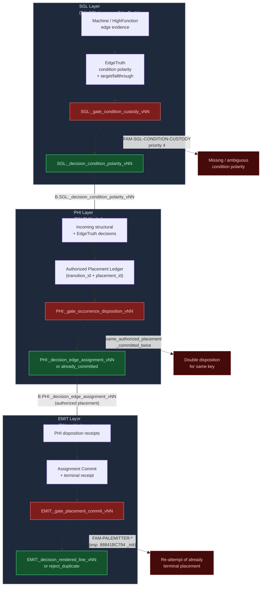
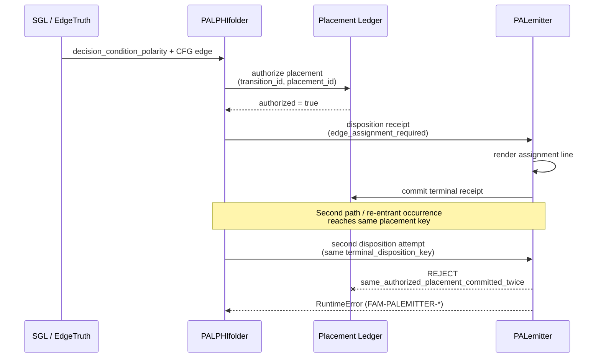
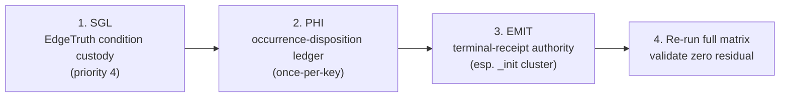

# PAL 3-Layer Transaction Graph (SGL → PHI → EMIT)

> Derived from Bug_Matrix_report 2026-07-28 (all families subsequently closed for mars alpha).  
> Focus: custody hand-off points that produced the dominant failure modes.

## Primary Transaction Graph

## Detailed Occurrence-Disposition Sub-Graph (PHI ↔ EMIT)

This is the most frequent failure pattern in the matrix (`same_authorized_placement_committed_twice`).

## Contract Normalization Points (patch targets)

| Layer | Gate | Expected Decision | Failure Mode in Matrix | Normalization Goal |
|-------|------|-------------------|------------------------|--------------------|
| **SGL** | `_gate_condition_custody` | `_decision_condition_polarity` | Missing / ambiguous polarity (FAM-SGL-CONDITION-CUSTODY) | Always emit explicit polarity or explicit unresolved |
| **PHI** | `_gate_occurrence_disposition` | `_decision_edge_assignment` **or** `already_committed` | Double commit of same key | Ledger is strictly once-per-key; second attempt returns `already_committed` |
| **EMIT** | `_gate_placement_commit` | `_decision_rendered_line` **or** `reject_duplicate` | Re-attempt after terminal receipt | Treat terminal PHI receipt as authoritative; never re-render same key |

## Recommended Execution Order (from matrix priority)

---

*Graph generated from Bug_Matrix_report_2026-07-28 analysis.*  
*All families shown were closed prior to mars alpha; this diagram captures the historical transaction structure that produced them.*
